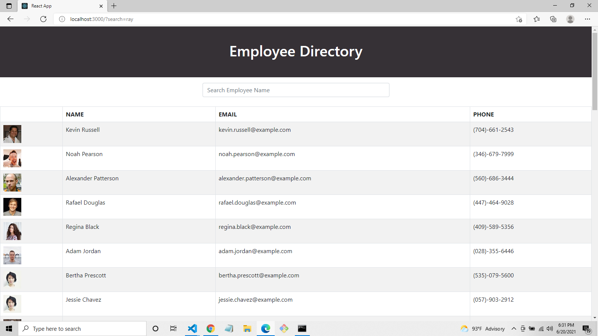

# Employee-Directory
   
  ## **Description**
  This application utilizes React to display an employee directory.  The employees displayed are retrieved using the Random User API.

  Click here to visit the deployed application on Heroku: [**Employee-Directory**](https://frozen-wave-08455.herokuapp.com/)

  

  ## **License**
   
  This project is covered under the MIT license

  ## **Questions**
  For additional questions, email me at [felicia.wootton@gmail.com](felicia.wootton@gmail.com) 
  Visit my Github profile at [fdwootton](https://github.com/fdwootton)